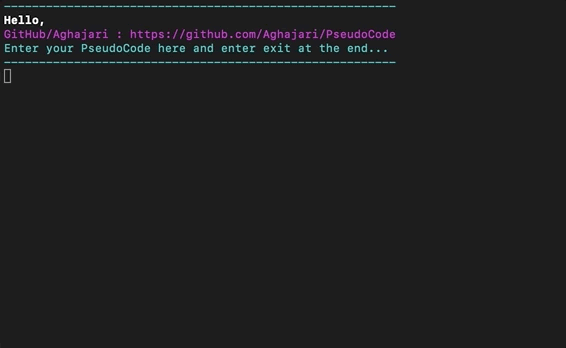

# PseudoCode
[JD Says:](https://users.csc.calpoly.edu/~jdalbey/SWE/pdl_std.html) Pseudocode is a kind of structured english for describing algorithms. It allows the designer to focus on the logic of the algorithm without being distracted by details of language syntax.  At the same time, the pseudocode needs to be complete.  It describe the entire logic of the algorithm so that implementation becomes a rote mechanical task of translating line by line into source code.
<br>
Here we go, A simple PseudoCode Reader, parser and compiler! We can develop this and after testing it get it's real source code in many different programming languages specially C and Java, Yay!



You can download the jar file from [here](./AXPseudoCode.jar) and test it right now!
<br><b>Note:</b> Don't forget to enter `exit` at the end of your PseudoCode.

```python
java -jar AXPseudoCode.jar

Enter your PseudoCode here and enter exit at the end...
--------------------------------------------------------
print "Enter 5 integers to get the average"
read x[5]
sum = sum(x)
print "Sum = " sum ", Average = " sum / x.length
exit
----------------
Wait a moment...
----------------
----------------
Let's start :)
----------------
Enter 5 integers to get the average
1 2 3 4 5
Sum = 15, Average = 3
----------------
DONE
----------------
```
## IF
Binary choice on a given Boolean condition is indicated by the use of four keywords: IF, THEN, ELSE, and ENDIF. The general form is:
```python
print "Enter an integer"
read n
IF n > 0
   print "+"
ELSE IF n < 0
   print "-"
ELSE
   print "0"
```
Opening/Closing statement (by Then, EndIf or {}) isn't necessary.

## WHILE
The WHILE construct is used to specify a loop with a test at the top. The beginning and ending of the loop are indicated by two keywords WHILE and ENDWHILE. The general form is:
```python
SET i to 0
WHILE i < 10
   i++
   print i
```
Opening/Closing statement (by ENDWHILE or {}) isn't necessary.

## REPEAT-UNTIL
This loop is similar to the WHILE loop except that the test is performed at the bottom of the loop instead of at the top. Two keywords, REPEAT and UNTIL are used. The general form is:
```python
sum = 0
n = 0
REPEAT
   print "Enter an integer"
   read n
   sum += n
UNTIL n != 0
print "SUM = " & sum
```
You can also use DO, WHILE instead of REPEAT, UNTIL.

## FOR
This loop is a specialized construct for iterating a specific number of times, often called a "counting" loop.  Two keywords, FOR and ENDFOR are used. The general forms are:

``` python
FOR i = 0 to 10
   print i
   
FOR i = 10 to 0 step -1
   print i
   
FOR i in range(10, 20)
   print i
   
x = [5, 4, 3, 2, 1]
FOR EACH i on x
   print i * 2
```
Opening/Closing statement (by ENDFOR or {}) isn't necessary.

## TYPES
Supports `%s`, `%d`, `%f`, `%b`, `%c`, ... or just write it's type like `BOOL` or `boolean`, `String`, `integer` or `int`, `double`, ...
```python
print "Enter your name and age : "
read %s:name, %d:age
print "Hello " name ", Your Age is " age
```

## DEFAULTS
```python
SET a to 24
SUBTRACT 10 from a 
ADD 15 to a
print a
// a = 29
```

## SAMPLES

- An algorithm to reverse array, for example [1, 2, 3, 4, 5] to [5, 4, 3, 2, 1]
```python
print “Please enter 5 integers”
read x[5]

reverse(x, 0, x.length - 1)
print x

Algorithm swap(x[], j, i)

temp = x[j]
x[j] = x[i]
x[i] = temp

Algorithm reverse(A[], start, end)

if (start >= end)
 return
else
 swap(A, start, end)
 reverse(A, start + 1, end - 1)
```

- An algorithm to sum digits of a number, for example 123 => 1 + 2 + 3
```python
print “Please enter a positive integer”
read m
n = m
sum = 0
r = 0
while (n != 0)
  r = n mod 10
  sum = sum + r
  n = n / 10
print “sum of digits of ” m “ = “ sum
```

- An algorithm to get gcd of n numbers
``` python
print "Enter the number of integers"
read n
print "Enter " n " integers"
read x[n]
print "GCD = " GCD(x)
```

## Author
Amir Hossein Aghajari

### SUPPORT ❤️
Support this project by joining [**stargazers**](https://github.com/aghajari/PseudoCode/stargazers) for this repository ⭐️


License
=======

    Copyright 2021 Amir Hossein Aghajari
    Licensed under the Apache License, Version 2.0 (the "License");
    you may not use this file except in compliance with the License.
    You may obtain a copy of the License at

       http://www.apache.org/licenses/LICENSE-2.0

    Unless required by applicable law or agreed to in writing, software
    distributed under the License is distributed on an "AS IS" BASIS,
    WITHOUT WARRANTIES OR CONDITIONS OF ANY KIND, either express or implied.
    See the License for the specific language governing permissions and
    limitations under the License.

<br>
<div align="center">
  
  <br><a>Amir Hossein Aghajari</a> • <a href="mailto:amirhossein.aghajari.82@gmail.com">Email</a> • <a href="https://github.com/Aghajari">GitHub</a>
</div>
